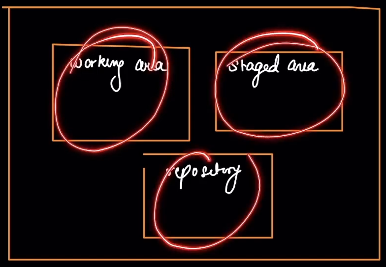
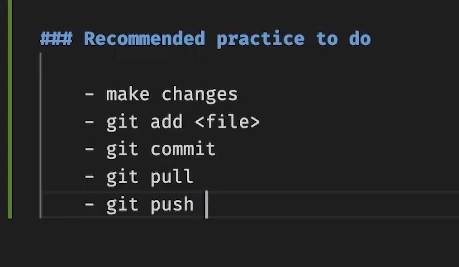

# Git & GitHub

Git is a **distributed version control system (DVCS)** designed to track changes in source code during software development.

- Created by **Linus Torvalds in 2005** for managing Linux kernel development.  
- Widely used for **collaborative coding, version control**, and **project history tracking**.  
- It's like a **history book** for your project, keeping track of every change you make over time.

---

### 🔑 Key Features of Git

- **Distributed System**: Every developer has a full copy of the repository, including history.
- **Branching & Merging**: Lightweight branches allow parallel development. Easy merging of changes.
- **Commit History**: Every change is tracked with a unique SHA-1 hash. Commits are immutable (changes create new commits).
- **Staging Area (Index)**: Allows selective changes before committing.
- **Fast & Efficient**: Optimized for performance, even with large projects.

---

### 🗂 Key Git Concepts

- **Repository (Repo)**: The main folder Git tracks. It contains all project files and change history.  
  _Think of it as your project's "history book"._

- **Working Directory**: Your local folder where you actually edit files.  
  _This is where you make changes._

---
### 👉 `git --version` - Checks version of the git we're using.

### 👉 `git config` 
> Used to configure Git settings at different levels (system, global, or local). Here's a breakdown of its usage:

**Syntax** : `git config [<options>] <key> [<value>]`

**Set a configuration value**
- `git config --global user.name "Your Name"`
- `git config --global user.email "your.email@example.com"`

**Get a configuration value**
- `git config --global user.name`  Returns the configured username

**List all configurations**
- `git config --list`

**Edit the config file manually**
- `git config --global --edit`

### 👉 `cd` command 
**Change Directory** - Used in the terminal (Linux/macOS) or Command Prompt (Windows) to navigate between directories in the file system.

**Syntax** : `cd [directory_path]`

**Move to a specific directory** : `cd /path/to/directory`

- Example : `cd /home/user/Documents`

**Go to home directory** : `cd ~` or simply `cd`

**If a directory name contains spaces, enclose it in quotes** : `cd "My Projects"`

**Go back to the previous directory** : `cd -`
**Move to a subdirectory** : `cd folder_name`

### 👉 `mkdir` command (Make Directory) 
**Used to create new directories (folders)**

**Syntax** : `mkdir [options] directory_name`

**Create a Single Directory** : `mkdir new_folder`

**Create multiple directories at once** :  `mkdir folder1 folder2 folder3`

**After creating a directory, you can move into it with** : `mkdir new_project && cd new_project`

### 👉 `touch` command 
**Used to create empty files or update file timestamps.**

**Create a New Empty File** : `touch file.txt`
- If file.txt doesn’t exist, it will be created.
- If it exists, its last modified timestamp will be updated.

**Create Multiple Files** : `touch file1.txt file2.txt file3.txt`

**Force Create a File (Ignore Symlinks)** : `touch -h file_link` 
- Updates symlink timestamp (not the target file)

### 👉 `ls` command 
**It lists directory contents, showing files and subdirectories.**

**List files & directories in the current folder** : `ls`
- Output example: `file1.txt  folder1  folder2  script.sh`

**List files in a specific directory** : `ls /path/to/directory`
- Example: `ls /home/user/Documents`

**Show hidden files (starting with .)** : `ls -a`
- Example output: `.  ..  .bashrc  file1.txt  .hidden_file`

> `.git` is a hidden folder so to check it we need to run the command `ls -a`
### 🛠 `git init`

Used to initialize a new Git repository in your project directory.

**How to Use** : `git init`

#### What It Does:
- Creates a hidden `.git` directory (stores all version control data).
- Sets up the Git structure for tracking changes.
- Prepares your project for version control.

**Initialize in a specific directory:**
`git init <directory-name>`

**Delete Git from my project** : `rm -rf .git` [Deletes the .git folder]

### 🛠 `git status` 
This command shows the current state of your Git repository, including:
- Staged changes (ready to commit)
- Unstaged changes (modified but not staged)
- Untracked files (new files not yet added to Git)
```
On branch main  
Your branch is up to date with 'origin/main'.  

Changes to be committed:  
  (use "git restore --staged <file>..." to unstage)  
        modified:   README.md  

Changes not staged for commit:  
  (use "git add <file>..." to update what will be committed)  
  (use "git restore <file>..." to discard changes)  
        modified:   index.html  

Untracked files:  
  (use "git add <file>..." to include in what will be committed)  
        new-file.txt  
```

### Three Major Working Areas in Git's Architecture


**1. Working Directory (Working Tree)**
- Where you edit files (untracked or modified). Files that are not currently handled by Git.
- Files here are not yet staged for commit. Changes done/ to be done in those files are not managed by Git yet.
- Check changes with : `git status` [Will show some untracked files.]

**2. Staging Area (Index)**
- Files added (`git add`) but not yet committed.
- Acts as a "preview" of the next commit. It knows what changes will be done from the last version to the next version.
- View staged changes : `git diff --staged`

- **Remove A File from Git Tracking (Keep it Locally)**

    <u>Example</u>: You accidentally staged a file (like database.yml) and want to remove it.

      `git rm --cached database.yml`

**3. Repository (Git Directory / .git folder)**
- Containts the details of all your previously registered version.
- Where commits are permanently stored after git commit.
- View commit history : `git log`

**Visual Workflow**
```
Working Directory → (git add) → Staging Area → (git commit) → Repository
```
`commit` -> Commit is a particular version of the project. It captures a snapshot of the project's staged changes & creates a new version out of it.

**What You Should Do after `git add` & `git commit`**

Vim Editor will open → Press i to enter insert mode → Type your commit message at the top (e.g., "Add README file") → Remove or leave the commented lines (lines starting with #)

To save and exit:
- In vim: Press ESC, then type `:wq` and press Enter

`git restore` command is used to undo changes in your working directory or staging area. [Safer alternative to some git reset operations]

It Discard unstaged changes in working directory : `git restore file.txt`
- Reverts file.txt to last committed state
- Equivalent to old `git checkout -- file.txt`

`git restore --staged` command is used to unstage files - It removes files from Git's staging area (`index`) while keeping your changes in the working directory. 

This is useful when you've accidentally staged files you don't want to commit yet.

`git restore --staged <file>`

**Unstage multiple files** : `git restore --staged file1.txt file2.js`

**Unstage all files** : `git restore --staged .`
```
Working Directory  --git add-->  Staging Area  --git commit--> Repository
                  <-git restore --staged-
```
**Compare Between Branches** : `git diff branch1..branch2`
- Example : `git diff main..feature`

**Compare Across Commits** : `git diff commit1 commit2`
- Example (show changes between two commits): `git diff abc123 xyz456`

**To avoid Vim Editor while opening the file** : `git commit -m <file name>`

---

## ✅ What to Do After `git init`:

1. **Add files to staging**:  
   ```bash
   git add .
   ```
2. **Make your first commit**:  
   ```bash
   git commit -m "Initial commit"
   ```

> **Note:**
> - You only need to run `git init` once per project.
> - If the directory already has files, use `git add` and `git commit` to track them.

---

## ⏳ Commit History Example

```bash
git init
git add .
git commit -m "First Commit"     # Checkpoint 1
git add .
git commit -m "Second Commit"    # Checkpoint 2
git add .
git commit -m "Third Commit"     # Checkpoint 3
```

> Each commit generates a unique commit ID.

---

### 🔄 `git checkout`

Used to switch branches, restore files, or navigate to specific commits.

### Common Usage:
```bash
git checkout <branch-name>    # Switch to an existing branch
git checkout main             # Switch to the 'main' branch
git checkout feature          # Switch to the 'feature' branch
git checkout -b <new-branch>  # Create and switch to a new branch
```

### In Newer Git Versions (≥2.23):

Use `git switch` instead:

```bash
git switch <branch>           # Instead of git checkout
git switch -c <new-branch>    # Instead of git checkout -b
```

---

## 🚀 Create a New Git Repository (Step-by-Step)

```bash
git init                          # Initialize a new Git repo
git add .                         # Stage all changes
git commit -m "Initial commit"   # First commit
git branch -M main                # Rename default branch to 'main'
git remote add origin https://github.com/your-username/repo.git
git push -u origin main           # Push code to GitHub (sets upstream)
```

### `git remote add` Connects two repos. We can name our connection. [Generally Name `origin`. We can write any name instead.]
Connection happened between our Local Repo to Git Repo. 
Now to upload the changes from our Local Repo to Git Repo -

- `git push <name> <branch name>`
- `git push origin master`



## 📥 `git clone`

Downloads an existing remote repo to your local machine.

```bash
git clone <repository-url> [destination-folder]
```

- `<repository-url>`: The HTTPS or SSH URL of the remote repo.
- `[destination-folder]` _(optional)_: Custom folder name (default is repo name).

---

## 🔄 `git pull`

Downloads and merges the latest changes from a remote repo into your current branch.

```bash
git pull <remote> <branch>
```

Example:
```bash
git pull origin main
```

- Fetch + Merge = `git pull`

---

## 🔃 `git fetch`

Downloads the latest changes from a remote repository without merging them.

---

## 🔀 `git merge`

Combines changes from one branch into another.

### Example:
```bash
git checkout main
git merge feature-branch
```

> Merges `feature-branch` into `main`.

---